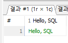
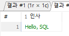

1. data.zip 압축풀기
2. heidisql 실행
3. 도구 -> csv 파일 가져오기

- server 분석에 실패중
dbearver 검색

heidi와 dbeaver 뭘 쓰든 무관
maria db와 연결을 해보자

일단 heidi를 쓰기로함

# SQL문
- 최근에는 NoSQL 개념이 뜨고 있기는 하지만 대부분 IT 서비스 데이터가 저장되는 곳은 관계형 데이터베이스 인데,
해당 DB에 접근할 수 있는 프로그래밍 언어가 SQL(Structured Query Language : 구조화된 질의 언어)문이다.
그래서 데이터가 저장된 곳에 특정 조건을 만족하는 데이터를 조회하는 부분을 옛날에는
개발팀에서 맡아서 했었기 때문에 다른 직군의 직원들이 개발팀에 요청을 해왔다.
- 마케팅 부서에서 프로모션 기간 동안 매출 증가 자료를 개발팀에 요청
- 개발팀은 해당 자료에 대한 SQL문을 조직해서 실행한 다음에 필요한 데이터를 뽑아내서 업무 담당자에게 회신

하는 과정을 거쳤었는데, 최근에는 개발직군이 아닌 분들이 SQL을 직접 다루는 방식으로 스스로 처리할 수 있게끔 하는중
- 원래는 사내 DB를 일반 직원들에게 오픈하길 꺼렸지만, 요즘은 오픈하는 분위기
- 엄청 보수적이지 않다면 기본적으로 SQL역량을 탑하는 느낌
- 특정 매출 자료 를 분석하고 시각화해서 브리핑하면서 인사이트를 얻을 수 있도록 보조한다면 데이터 분석가

- 컴퓨터에게 데이터를 가져오라는 일을 시킬때 그 형식이 어느정도 정해져 있는 질의 언어로 컴퓨터에게 잘 시키는 언어

- 기본적으로 RDB를 다루기 위해 고안된 언어라 NoSQL에서는 조금 다른 방식으로 작동
- 개발자직군은 SQL과 NoSQL 역량이 필요하다
- NoSQL , SQL을 안씀 Not Only SQL

- SELECT * - 데이터를 전부 가져와
- FROM table_table - table_table에 있는 녀석으로 

간단한 튜토리얼을 확인하고 싶다면 w3school

## sql의 종류
1. DML(Data Manipulation Language) : 데이터 조작 언어라고 보통 번역되고, DB의 내부 데이터를 관리하기 위한 기능. 주로 CRUD의 기능을 수행하기 때문에 주요 명령어로<br>
`Insert,select,update,delete`

2. DDL(Data Definition Language) : 데이터 정의 언어, RDB 내의 저장 단위인 테이블과 컬럼을 정의하고 관리, 저장 공간을 생성하고 수정하고 삭제하는 등의 데이터 저장공간을 결정
`Create, Drop, Truncate`
Drop은 테이블을 날리고, Truncate는 내부 데이터를 비워버린다.

3. DCL(Data Control Language) : 관리 목적으로 DB에 접근하려는 사용자의 권한을 관리하거나 보안과 관련된 기능을 담당. `Grant, Revoke`

4. TCL(Transaction Control Language) : 트랜젝션 제어 언어, 데이터베이스를 조작하는 명령 단위인 트랜잭션을 제어하고 관리할때 사용하는 기능
`Commit,Rollback`

## 알아두면 좋은 필수 개념
- 데이터베이스 : 데이터를 저장하고 관리하는 시스템
- 관계형 데이터베이스 : 데이터를 테이블 형태로 관리하는 데이터베이스,
    키를 기반으로 특정 관계로 연결
- 테이블 : 행과 열로 구선된 데이터를 저장하는 기본 단위
    - 각 테이블은 고유한 식별자인 기본 키를 가진다.
    - 관계를 맺을 때는 외래키를 사용
- 컬럼 : 속성에 해당하는 데이터를 저장하는 공간

```java
public class Person{
    private String name;
    private Integer studentId;
}

```
와 같은 클래스가 있을대, 이를 객체 생성을 하고, DB에 저장했다면 <br>
Person 테이블에 각 컬럼이 name, studentId가 된다.

- 행(row)) : 테이블에서 가로줄, sql에서는 레코드라고 부르기도 한다. 테이블에서 하나의 개별 데이터 단위를 나타낸다.

```java
public class Main
    public static void main(string[] args){
        Person person1 = new Person('김일',2026001);
    }
```
김일, 2026001이라는 row가 생길것이다.<br>
java적으로 클래스의 인스턴스에 해당한다고 볼 수 있다.

- 기본키 : 각 행을 고유하게 식별할 수 있는 값, 기본키는 하나가 아닌 여러 값의 조합도 가능하다.

- 외래키 : 외래 키는 다른 테이블의 기본키와 매칭되어 해당 테이블과의 관계를 정의한다.<br>
테이블끼리 결합할때 사용.

# 원하는 데이터를 가지고 오고 필터링 하기
1. 데이터 처리 4 요소 : 생성 / 조회 / 수정 / 삭제 - CRUD <br>
    sql 뿐만 아니라 다른 프로그래밍 언어에도 데이터 처리 개념자체는 존재한다. <br>
    SQL은 관계형 데이터베이스(RDB)의 데이터를 다루는 주요 언어에 해당한다. <br>
2. 이번 수업에서는 기본적으로 더미 데이터를 가지고 있는 상황에서 다양한 조건에 해당하는 데이터 들을<br>
    필터링해서 가지고 오는 부분에 초점을 맞출 예정<br>

## SELECT
- 이상에서 작성한 '무엇'을 가져와야하는지에 해당한다.

```sql
SELECT "Hello SQL!";
```
컨트롤 + 쉬프트 + f9, 커서가 있는 라인만 실행

- Select문의 경우 어느 컬럼을 보여줄지를 지정하는 역할을 한다.
- 하지만 FROM 절을 작성하지 않은 상태에서는 SELECT 뒤에 적은 문자열을 기준으로 컬럼명을 생성하고 내부에 row를 그대로 보여준다.

* 참고 : 대소문자 구분안함, 하지만 시험상황에서 보통 SQL 명령문은 대문잘로 작성된다.

- SELECT : ~을 보여달라. 사실상 show
```sql
SELECT 'Hello, SQL!'; 여기서는 str이 아니라 varchar이다.
보여달라 이 내용을
```
- 데이터 조회를 시작할 때 늘 SELECT로 시작하기 대문에 CRUD 중 R 업무를 시작한다고 해석해도 무방

```sql
SELECT 12+7;
```

- AS : 컬럼명을 지정할 때 작성하는 방식

```sql
SELECT 'Hello, SQL' As 인사;
```
- 참조 : as뒤에 별칭을 지정할 때에는 DBMS를 타는 경우가 있긴한데 따옴표를 신경쓰지 않는다.<br>
 

```sql
SELECT 28+891,19*27;
SELECT 37+172 AS 'plus' , 24*78 AS 'Times', 'I love SQL!' AS 'Result';

```

## FROM
1. 데이터가 저장된 위치를 알려주는 부분.

```sql
SELECT *
FROM users;
```

- `*` : 별표 / 와일드 카드 / 애스터리스크라고 불리며 테이블 내의 모든 컬럼을 지시한다.
(Java / SpringBoot에서도 쓴다.)
- import * 에서 사용
- `*`는 패턴 매칭에서 하나 이상의 문자를ㄹ 대체할 수 있는 기호를 의미한다.<br>
패턴 매칭이랑 문자열, 파일, 데이터 등에서 주어진 패턴이나 규칙에 맞는 부분을 찾아내는 과정으로 예를 들어 `*.txt`라면 모든 txt 확자를 지정

- 개행과 들여쓰기는 파이썬과 달리 아무영향이 없다.
가독성 때문에 쓰는데 회사마다 쓰는 방법이 달라서 유연하게 작성하는게 좋다.

```sql
SELECT *
FROM users LIMIT 3;
```
전체 데이터가 아니라 일부 데이터만 가지고 오기 위해서 개수를 지정하는 명령어로 `LIMIT`를
쓴다.<br>
어느 DB를 쓰는가에 딸라 `TOP`을 쓰는 곳도 있다.

- full scan : 특정 테이블의 모든 정보를 조회하는 것.<br> 
단순히 데이터를 파악하고 싶다면 limit을 쓰는 습관을 들이는것이 좋다.

```sql
SELECT * 
FROM orderdetails;

SELECT * 
FROM users LIMIT 7;

SELECT id,user_id,order_date 
FROM orders ;

```


## where
1. 어떤것을 고를지 설정
- select / from에서 보여줄 내용을 정했다면, 보여줄 조건을 설정한다.
2. select 절에서는 세로 부분인 컬럼을 제어했다면 , where절은 가로인 특정 row만 가지고 오도록 제어한다.
3. 회원 정보 테이블에서 거주 국가가 Korea인 회원만 추출하기

- 데이터 전처리 : 혹시 회원이 Republic of Korea로 등록했는지/ South korea로 등록했는지 korea로 했는지 등.<br>

```sql
SELECT country 
FROM users
WHERE country != 'Korea';
-- korea가 아닌 country
-- And, or도 존재
```

users에서 가입일시가 2010-12-01부터 2011-01-01인 회원정보

```sql
SELECT *
FROM users
WHERE created_at;
```

```sql
SELECT *
FROM users
WHERE created_at between
'2010-12-01'and' 2011-01-01'
;
```
- `between`은 실제 쿼리 작성 시 날짜 조건을 적용할 때 자주 사용한다.<br>
[시작날짜]와 [종료날짜]를 포함한 그 사이 값을 조회하는데, created_at의 결과값들을 확인해보면<br>
yyyy-mm-dd HH:MM:SS로 되어있다.<br>
조건을 년원일까지만 작성하면 시분초는 0으로 인식한다.

```sql
SELECT *
FROM users
WHERE country IN ('Korea','UK' ,'USA');
-- WHERE country = 'Korea' || country = 'UK' || country ='USA';
```

* 참고 : And / or중 And가 우선순위가 더 높다

```sql
SELECT *
FROM users
WHERE country Like 'S%';
```

- `like` : where 조건문 중 일부 패턴에 일치하는 데이터만 검색할 수 있다.
    - `%` : 와일드 카드, 문자여럿이어도 한번 쓰면 됨
    - `_` : 임의의 문자하나

```sql
SELECT *
FROM users
WHERE country Like 'U_';
```

예시 : users에서 가입일시 컬럼이 null인것만 출력

```sql
SELECT *
FROM users
WHERE created_at is null;
-- = null은 안된다.
```

- `null` : 값이 없는 상태를 의미한다. 0이거나 ''(공백)도 아니다.

- `is` : null은 어떤 조건값으로도 조회할 수 없기 때문에 이러한 null값을 필터링할때 쓰이는 조건 연산자가 IS이다.

# sql 주석
- -- : 한 줄을 주석으로 만들때
- /* */ : 여러 줄을 주석으로 만들때

# 내일 수업
ORDER BY
, asc, desc