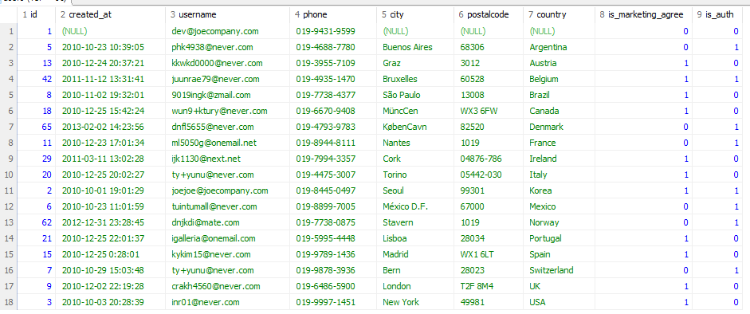
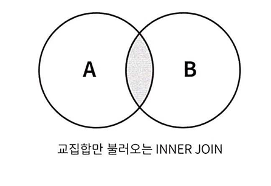
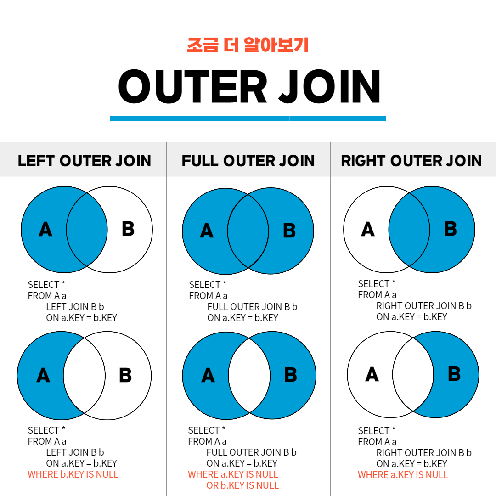
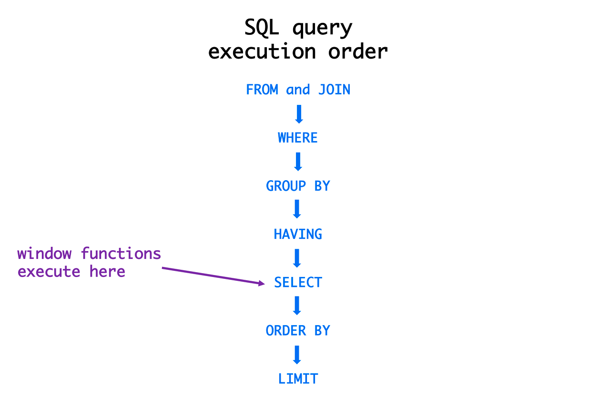

# sql

## group by

- 어떤기준으로 묶어서 계산 할 것인가

```sql
select *
from users
group by country;
```
을 호출했을 경우


라고 나온다.<br>
`select * from users;`를 호출 했으면 row가 77개인데 여기선 18개가 나왔다.<br>
country로 묶인것이다.


```sql
SELECT country,COUNT(id) AS 국가별사용자수
from users
WHERE country IS NOT null
group by country;
```

- group by를 이용하여 국가별 회원 수를 추출했다. group by는 **집계 함수와 함께 사용**되며
group by 기준 컬럼은 select에서 집계 함수를 사용할 때 묶어서 계산을 수행하는 기준.

- group by를 이용할 경우 데이터를 분류하고 계산하면서 데이터의 특성을 더 잘 파악할 수 있다.

```sql
SELECT country,COUNT(id) AS 한국동의자수
FROM users 
WHERE country IN ('korea','usa') AND is_marketing_agree = 1
```

위 코드는 정상 동작하지 않는다.
country가 korea만 출력되고 id는 usa랑 합산된다.

```sql
SELECT country,COUNT(id) AS 동의자수
FROM users 
WHERE country IN ('korea','usa') AND is_marketing_agree = 1
GROUP BY country;
```

이렇게 해야만 korea, usa 2개가 따로 나온다.

```sql
SELECT country,is_marketing_agree AS 마케팅수신동의,COUNT(id) AS 회원수
FROM users 
GROUP BY country, 마케팅수신동의
ORDER BY country, 회원수 desc ;
```
이상과 같이 실행했을때 group by와 select중 select가 먼저 실행 된것을 알 수 있다.
(order by는 마지막)

추론 가능한 실행 순서
1. from
2. select
3. group by - 편집된 컬럼명으로 분류 가능
4. order by

- 그럼 시험에서 적용순서에 관해선 어떻게 나왔나
- DBMS마다 편집된 컬럼(as)을 허용하지 않는 경우가 있기때문이다.
- 마찬가지로 order by처럼 group by도 작성된 순서를 기준으로 한다.

분석 시에 지표를 그룹으로 묶는 기준을 차원(dimension)이라고 하고,<br>
각 차원에 대한 계산을 수행할 때 적용하는 계산식을 매트릭이라 한다.

```sql
SELECT substr(created_at,1,7) AS 월별 , COUNT(id) AS 가입회원수
FROM users 
WHERE created_at IS NOT null
GROUP BY substr(created_at,1,7) -- 여기도 월별이라 써도 되지만, 굳이 이렇게 썼다.
ORDER BY 월별 desc;
```
여기서 중요한것은 SUBSTR() 함수가 컬럼에 적용되는 집계 함수가 아니라 row에 적용되는 일반함수라는 점<br>
즉, substr로 잘라낸 것을 기준으로 그룹화가 가능하다.

## group by 전체 정리
- 그룹별로 수치를 계산할 때 사용
- 콤마를 기준으로 두 개 이상 지정 가능, 이때 명시된 컬럼 순서에 따라 그룹의 층위가 결정되므로 순서를 명확하게 설계할 필요가 있다.

1. 
```sql
group by col1, col2, 두개 이상의 기준 지정
```
- group by 지정시에는 적은 컬럼을 select문에도 동일한 순서로 작성하여 계산된 수치의 기준을 알려주면 좋다.

```sql
select col1, col2,...
...
group by col1, col2

```

2. group by에 작성한 기준 컬럼은 distinct를 사용한 것 처럼 **중복 없이** 표시된다. 컬럼 값이 동일한 데이터는 같은 그룹으로 묶여 중복 제거가 일어난다.<br>
또한 group by에 작성한 기준 컬럼 외에는 중복 제거된 row들만 남게 되므로 추가적인 부분은 집계함수를 사용하여 그룹 별 연산을 따로 수행해줘야 한다.

```sql
select col1, col2, count(*), sum(col3)
...
group by col1, col2
```


```sql
SELECT order_id, SUM(quantity) AS 주문수량
FROM orderdetails
GROUP BY order_id
ORDER BY 주문수량 DESC;

SELECT staff_id,user_id,COUNT(id)
FROM orders
GROUP by staff_id,user_id
order by staff_id,COUNT(id) desc;

SELECT SUBSTR(order_date,1,7) AS 월별, COUNT(distinct user_id)
FROM orders
GROUP by 월별
ORDER BY 월별 desc;

```

## Having
- 집계값은 어떻게 필터링 하는가?
    - 예를 들어 회원수가 n명 이상인 국가의 회원 수만 보고 싶다면 어떻게 해야하는가?
    와 같은 질문에 답변할 수 있습니다.
    - 현재 상황에서 where은 select 이전에 실행됙 때문에 집계함수가 적용전이라서
    count() 함수의 적용 후 결과값을 where절에 반영할 수 없다는 문제점이 있겠네요.
    - group by로 그룹화 하고 집계한 데이터를 필터링할 때 where을 쓰기 어려운 이유를 알아보고 <br>
    Having로직을 학습하겠습니다.

```sql
SELECT country ,COUNT(id) AS 국가별회원수
FROM users
WHERE country IN ('korea','USA','france')
GROUP BY country;

```

특정 국가의 회원수는 where을 통해 추출이 가능하다.<br>
하지만 3개 국외 회원수 말고 전체 국가를 기준으로 8명 이상인 국가의 회원 수만 추출하기 위해서는 집계함수의 실행이 선행되어야 한다.

```sql
where count(distinct id) > 7
```

위 코드는 오류가난다.<br>
Having을 쓰면

```sql
SELECT country ,COUNT(id) AS 국가별회원수
FROM users
GROUP BY country
Having count(distinct id) > 7
order by 국가별회원수 desc;
```

```sql
SELECT staff_id AS 담당직원, COUNT(id) AS 주문건수, COUNT(user_id) AS 주문회원수
FROM orders
GROUP BY staff_id
HAVING 주문건수 >= 10 AND 주문회원수 <= 40
ORDER BY 주문건수 DESC;

-- 주문건수는 orders에선 그냥 id, 
```

연습문제 답

```sql
SELECT user_id AS 회원 , COUNT(id) AS 주문건수
FROM orders
group BY user_id
HAVING COUNT(id) >= 7
ORDER BY 주문건수 desc;

SELECT country AS 국가,COUNT(distinct city) AS 도시수, COUNT(id) AS 회원수 
FROM users
GROUP BY country
HAVING 도시수 >= 5 AND 회원수 >=3
ORDER BY 도시수 DESC, 회원수 DESC;

SELECT country AS 국가, COUNT(id) AS 회원수
FROM users
WHERE	country IN ('korea','brazil','USA','Argentina','Mexico')
GROUP BY country
HAVING 회원수 >= 5
ORDER BY 회원수 DESC;
```

## sql 실무에서의 사례 - group by / having
1. 배달서비스 앱에서 : 2023-08에 음식 분류별(한식, 중식, 분식, ...)
주문 건수 _집계_
```sql
select 음식분류 , count(distinct id) as 주문건수
from 주문정보
where 주문시간(월) = '2023-08' # where은 중복제거가 아니니까
group by 음식분류
order by 주문건수 desc;
```

2. 차량대여서비스 에서 주행거리가 3000km 이상인 회원 수를 차량 종류별로 추출
```sql
select 차량종류, count(distinct 회원아이디) as 회원수
from 차량운행정보
group by 차량종류
Having sum(주행거리) >= 3000
Order by 회원수 desc;
```

3. sns에서 : 팔로워가 2000명 이상인 회원수를 국가별로 추출
```sql
select 국가명, count(distinct 회원아이디) as 회원수
from 팔로워 정보
group by 국가명
Having count(distinct 팔로워 아이디) >= 2000
order by 회원수 desc;
```

# 여러 가지 데이터를 원하는대로 합치기
## 학습목표
- 여러 테이블에 분산된 데이터를 하나로 모아서 다루는 법을 익힐 수 있다.
- sql에서 'join'은 여러 테이블에서 데이터를 가져와 결합하는 기능을 하는데, 엑셀에서는 Vlookup함수와 유사한 기능이다.
엑셀에서는 여러개의 시트를 하나로 합쳐서 표현해야 할 때가 있는데, sql에서 동일하게 다수의 테이블에 흩어져 있는 데이터들을 모아서 하나의 테이블로 구성하는 키워드이다.
- 저희 수업 기준으로는 특정 주문을 담당한 직원의 이름을 확인하고 싶다면, 주문 아이디는 orders 테이블에 존재하기 때문에 별개의 테이블에서 데이터를 추출한 다음, RDBMS에 맡게 row를 구성해야한다.

- 학습범위
1. 테이블을 좌우로 결합하는 `join`
2. 테이블을 상하로 결합하는 `union`
3. 임시로 테이블을 구성해놓고 그걸 기주능로 select문을 실행시키는 `sub query`

### 학습 범위 추가 설명
1. 테이블을 좌우로 결합하는 join
    - orders에서 직원 정보 테이블인 staff를 합친다고 가정했으 때, 두 테이블을 합칠때의 '기준'이 필요하다. 공통되는 부분이 있어야 3번 아이디 주문을 한 사용자와 직원이 있을거고, 그 담당 직원을 뽑아낼 수 있을테니까.<br>
    `join`은 두 테이브르이 컬럼 구성이 **달라도 결합이 가능**하며, 같은 테이블을 결합하더라도 선택하는 join 유형에 따라서 다른 결과가 나온다. 테이블을 결합하는 기준은 key
2. 테이블을 상하로 연결하는 union
    - join은 테이블을 좌우로 결합하여 데이터의 컬럼수가 늘어나는 반면에 union은 **컬럼 구성이 같은 두 쿼리 결과 집합을 상하로 결합**한다. 따라서 union으로 데이터를 결합한 결과는 결합전의 컬럼 구성과 동일하다. 그렇다면 도출되는 제약 조건은 결합 대상인 두 쿼리의 결과 집합은 컬럼 개수와 같아야만 한다.
3. 눈속임 테이블을 임시로 만드는 서브 쿼리
    - 데이터가 저장된 상태 그대로 쿼리를 수행하기도 하지만 **쿼릴를 수행한 결과를 값이나 조건으로 하여** 쿼리를 수행하기도 한다. 즉, 쿼리속의 쿼리를 이용하기도 하는데, 필요한 값이나 테이블이 없으면 임시로 만드는 서브 쿼리의 개념이 존재한다.


## join

복수의 테이블을 하나로 연결할 때는 여러 조건을 적용할 수 있는데, 특히 공통 부분인 키를 활용하여 join에서 제공하는 기능을 학습하겠다.

- 기본적으로 좌우로 합친다는 점이다.

```sql
SELECT *
FROM users u , orders o
WHERE u.id = o.user_id
ORDER BY u.id;

SELECT *
FROM users u INNER JOIN orders o ON u.id = o.user_id
ORDER BY u.id;

-- 이 둘의 출력은 완전히 같다.
```


```sql
SELECT *
FROM users u left JOIN orders o ON u.id = o.user_id
ORDER BY u.id;
```
left는 포함되지 않는것도 포함된다.

- join 테이블 1 약침 1, 테이블 약침 2 on 약침1.pk = 약침2.fk;
- 여러 테이블을 하나의 from에서 다룰 때에는 약칭을 설정하는 것이 가능하다.
다만 컬러명을 직접적으로 수정하는 것이 아니기 때문에 AS가 붙지 않는다. 그리고 이렇게 설정한 약칭은 각 테이브르이 개별 컬럼에 접근할 때 사용한다. 

- key의 개념 : 두 개의 테이블에서 공통된 부분을 RDB에서 key라고 하는데, 관계형 데이터베이스에서 키 값은 테이블에 반드시 1개 이상 존재하도록 설계되어 있고, 테이블에서 개별행을 유일하게 구분짓는다. 따라서 키 값은 컬럼 내에서 중복되지 않으며 개별 행을 구분해야 하므로 null값을 가질 수 없다.

- 이상의 개념에서 알 수 있는 것처럼 유일하게 식별하는 고유값이기 대문에 이 값을 중복없이 카운트하면 정확히 계산할 수 있다. <br>
그래서 내테이블.id = 남테이블.kf명 처럼

* 참조 : 키 값은 테이블 내에서 고유한 값을 가지므로 한 테이블에서 개수를 계산할 때 중복되지 않아야 하는데, 여러 테이블을 조인한 경우 키값도 중복될 수 있다.

- 그러면 users에서의 고유값이 중복되었으니까 join 연산 결과에서 중복이 안되는 값은 o.id

- PK vs. FK(Foreign Key)
    - 키 값은 기본 키와 외래 키로 나울 수 있다. PK는 각 테이블이 자체적으로 가지고 있는 고유한 키 값에 해당하고, FK는 다른 테이블이 가지고 있는 PK를 참조한 키 값에 해당한다. 그렇기 때문에 PK와 같은 자료형을 가진다. 또한 그 값도 다른 테이블이 PK와 동일하다.<br>
    예를 들어, PK의 값이 A,B,C만 존재한다면 FK역시 A,B,C만 존재한다.
    - 하지만 차이점으로 FK는 Pk와 달리 중복이 일어날 수 있다.(1:N또는 N:M 관계)

### Inner Join
- 두 테이블의 키 값이 일치하는 row의 정보만 가지고 옴. 수학에서의 집합을 예로 든다면 교집합에 해당



- 문제 : users 테이블의 id(컬럼명 유저아이디), username, created_at, phone, marketing_agree, country, city와 orders 테이블의 id(컬럼명 주문아이디), staff_id, order_date를 INNER JOIN하여 출력하시오

```sql
SELECT us.id AS 유저아이디, us.username, us.created_at, us.phone, us.is_marketing_agree, us.country, us.city,os.id AS 주문아이디,os.staff_id, os.order_date
FROM users us INNER JOIN orders os ON us.id = os.user_id
ORDER BY us.id;
```

## LEFT JOIN

- 교집합 뿐만 아니라 join 명령문의 왼쪽에 위치한 테이블의 모든 결과값을 추출한다. <br>
예시에서는 users 테이블이 왼쪽에 위치하므로 users 테이블의 모든 결과 값을 가지고 오는데, 만약에 주문 정보가 없다면 u.id = 1에서 확인할 수 있듯이 orders 테이블 부분의 컬럼들에 null 값으로 가지고 오게 된다.
- 왼쪽 테이블의 차집합 + 왼 오 교집합

- 그냥 왼쪽 테이블의 값을 다 가져온다.

`left join`또는 `left outer join`이라고 한다.

- left/inner join은 실무에서 자주 쓰인다. 데이터를 결합하는 경우 대부분 한쪽 테이블의 값을 보전해야 할때가 많은데, 이번의 left join에서도 그렇습니다.

- inner join과 달리 주문 정보가 없는 값만 추츨 가능

users와 orders를 하나로 결합하여, 주문정보가 없는 회원의 정보 추출

```sql
SELECT *
FROM users us left JOIN orders os ON us.id = os.user_id
WHERE os.id IS null
ORDER BY us.id;
```

- 위 코드는 users 테이블과 orders 테이블의 교집합을 뺀 차집합 부분
- 차집합은 inner로 만들기 어렵다.

```sql
SELECT u.id AS 회원아이디 , u.username AS 이메일, u.phone AS 연락처, o.id AS 주문아이디, ods.product_id AS 제품아이디
FROM orderdetails ods, users u , orders o
WHERE ods.order_id = o.id AND u.id = o.user_id
ORDER BY u.id;

SELECT u.id AS 회원아이디 , u.username AS 이메일, u.phone AS 연락처, o.id AS 주문아이디, ods.product_id AS 제품아이디
FROM users u 
LEFT join orders o ON u.id = o.user_id
inner JOIN orderdetails ods ON ods.order_id = o.id
ORDER BY u.id;
-- 위는 내가 배운 oracle 8.1 이하 방식, 밑이 join
```

```sql
SELECT *
FROM users u RIGHT JOIN orders o ON u.id = o.user_id
order by o.id;
```

이상의 경우에 결과를 확인해 보면, inner join과 실행 결과가 동일하다고 나오는데, 예시로 사용한 테이블간의 포함ㅁ관꼐 때문. 예를 들어 가상의 웹 사이트에서 users 테이블에 id가 없는 회원의 정보는 orders 테이블에 존재할 수가 없기 때문에 회원 정보가 없는 주문 정보는 존재할 수 없다.
그 결과 inner join과 동일해 보인다.
- 많은 실무시 right joiin대신 left join을 사용할 것을 권장한다.





## 시험용 select 문 실행 순서


1. from(join포함) : 대상 테이블을 참조하고 join 적용으로 합쳐진 데이터셋을 구성
2. where : 행 단위를 필터링
3. group by : 데이터를 특정 컬럼 기준으로 그룹화
4. Having : 그룹화된 데이터에 조건을 걸어서 필털링
5. select : 출력한 컬럼 선택하고 Alias 부여(컬럼명 편집 시점)
6. distinct : 중복된 행을 제거
7. order by : 데이터 정렬
8. LIMIT,TOP,OFFSET : 최종결과중 출력할 개수 제한

### 이상의 순서에서 중요한 점
1. 별칭('Alias')의 제약 : where 절에선 못 쓰는데 order by에선 가능(실행 순서상의 이유)
2. 성능 최적화 : 실행 순서를 기반으로 최적화 가능, where절에서 데이터 개수를 줄여놓으면 group by나 order by시 부하가 줄어든다.
3. 표준에서의 예외 : 요새 DBMS는 사용자 편의를 위해 group by에서 selectㄹ를 허용하기는 하지만 이론적으로는 sql에서 where/group by에서 별칭 사용이 불가
