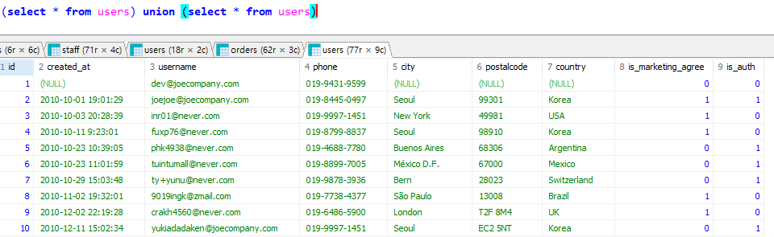

## cross join
모든 가능한 행조합

```sql
Select *
from users u
cross join orders o
order by u.id;
```

- cross join은 두 집합을 조합해 만들 수 있는 모든 경우의 수를 생성하는 `카테시안 곱`을 출력한다.
u.id와 o.user_id를 연결하는 등의 조건이 없이 두 테이블의 모든 행을 합쳐서 만들 수 있는 모든 경우의 수를 만드는 것에 해당한다.
- 예를 들어 10행인 테이블과 20행인 테이블을 corss join하면 200행이 된다.
- 모든 경우의 수를 생성하기에 on을 쓸 필요 없다.(키를 쓸 필요 없다)

## join에 대한 전반적인 정리
- 두 테이블의 행을 서로 조합하는 과정인데, 여러가지(left, right,inner,cross,full outer)가 존재하면서 on 조건을 활용하여 전체 경우의 수에서 어떤 행만 가져올 수 있을지를 정할 수 있다.
- full outer join의 경우 cross join과 차이가 존재하는데, left join의 결과 값과 right join의 결과값을 `중복없이 결합`하는 개념으로, 합집합에 해당.
전체를 구하는 컨셉을 유사하나 합집합이 전체 경우의 수를 의미하는것은 아니기때문에 구분해서 사용할 필요가 있다.
- cross join과 달리 on 요규
- 운영 환경에서는 cross join을 제한하는 편, 전체 경우의 수가 필요하지 않는 경우도 있기 때문에
- full outer join의 경우 DB에 따라 아예 지원하지 않기도 함.

### 연습문제
1. users와 staff를 참고하여 회원 중 직원인 사람의 회원 id, 이메일, 거주도시, 거주국가, 성, 이름을 출력하시오.

2. staff와 orders를 참고하여 직원 아이디가 3번, 5번인 직원의 담당 주문을 출력하시오. 단 직원id, 직원 성, 주문 아이디, 주문일자만 출력하시오.

3. users와 orders를 참고하여 회원 국가 별 주문 건수를 내림차순으로 출력하시오.

4. orders와 orderdetails, products를 참고하여 회원 아이디 별 주문 금액의 총합을 정상 가격과 할인 가격 기준으로 각각 구하시오. 단, 정상 가격 주문 금액의 총합 기준으로 내림차순 정렬할 것.

5. 이하의 조건에 해당하는 테이블이 있다고 가정했을 때 질문에 답하시오.

    - 왼쪽 테이블 A : 컬럼 개수 5 개 / 150 행
    - 오른쪽 테이블 B : 컬럼 개수 7개 / 100 행
    - 두 테이블은 공통 키 값 컬럼을 1 개 보유 위 조건의 두 테이블을 CROSS/LEFT/RIGHT/INNER JOIN으로 결합했을 때 결과 테이블의 행과 열 개수를 계산하시오(SELECT * 기준)

답
```sql
-- 1
SELECT u.id , u.username, u.city, u.country, s.last_name , s.first_name
FROM users u , staff s
WHERE u.id = s.user_id
;

-- 2
SELECT s.id, s.last_name,o.id,o.order_date
FROM orders o , staff s
WHERE s.id = o.staff_id AND s.id IN (3,5)
;

-- 3
SELECT u.country AS 회원국가, COUNT(u.country) AS 주문건수
FROM orders o , users u
WHERE o.user_id = u.id
GROUP BY u.country
ORDER BY  주문건수 desc
;

-- 4
SELECT o.user_id , round(SUM(p.price*ods.quantity),2) AS 정상가격총합 ,  round(SUM(p.discount_price*ods.quantity),2) AS 할인가격총합
FROM orders o, orderdetails ods, products p
WHERE o.id = ods.order_id AND ods.product_id = p.id
GROUP BY o.user_id
ORDER BY 정상가격총합 DESC
;

-- 5
cross
    - 15000행
    - 12열
left
    - 최소 150행, 최대 15000행(하나도 안겹친다면)
    - 12열 - *이라서
right
    - 최소 100행
    - 12열
inner
    - 최소 0 ~ 최대15000
    - 12열 
```
- 이상의 답안은 실무에서 일어날 수 있는 수준이고, 실제 시험에서는 실제 row계산정도는 할 수 있다.

## union
- 컬럼 목록이 같은 데이터를 위아래 결합
- 컬럼의 형식과 개수가 같은 두 데이터 결과 집합을 하나로 결합하는 기능
- join은 on이 요구된다는 점이 있지만 애초에 제약조건이 있는 union의 경우는 제약조건을 일치시킨다면 결합 자체는 가능함.

- 예제
- users를 full scan한 결과 집합에서 각행을 2번 씩 출력하기

```sql
(select * from users) union (select * from users)
```

이상의 쿼리는 77*2가 나와야 할것 같지만<br>
중복 제거가 작용한다.


- union 및 all을 적용했을 때 SELECT문을 쓸 때 full scan한다면 상관없지만 특정 컬럼만 보여주겠다고 한다면 첫 번째 테이블에서 컬럼을 편집한 것과 동일하게 두 번 째 테이블도 수정해야 한다.

```sql
(select id, phone, country, city from users)
union all
(select id, phone, country, city from users)
order by id;
```

부산지사에서 대구지사로 업무요청할 순 있지만 바로 열람이 불가<br>
본사에서 통합을 할때는 union으로 합칠 수 있다.
실무적으로 union보단 union all을 권장한다. 
대량의 데이터에서 중복 항목을 제거할 ㄸ때 부하가 일어날 수 있기 때문에 일단 중복되더라도 보여주는것을 좀 더 선호하고, 그 후에 조건절 등을 통해 분류한다.


- 국가가 korea인 것과 Mexico인 것만 결합
```sql
(SELECT * from users  WHERE country = 'korea')
union
(SELECT * from users WHERE country = 'mexico')
order by country;
```

### 연습문제
1. orders에서 주문일자가 2015년 10월인 건과 2015년 12월인 건을 select로 각각 추출후 union all

2. 'users에서 미국에 거주 중이면서 마케팅 수신에 동의한 회원 정보'와 프랑스에 거주 중이면서 마케팅 수신 동의 하지 않은 회원 정보를 SELECT로 각각 추출하고, 두 결과 집합을 UNION ALL을 사용해 하나로 결합하시오. 단 최종 결과는 id, 연락처, 거주 국가, 거주 도시, 마케팅 수신 동의 여부 컬럼만 추출하고, 거주 국가 기준 알파벳 순 정렬하시오. 컬럼명 한국어로 다 바꾸시오.

3. UNION을 활용하여 주문 상세 정보 테이블 orderdetails와 제품 정보 테이블 products를 FULL OUTER JOIN 조건으로 결합하여 출력하시오.

```sql
(SELECT * from orders WHERE SUBSTR(order_date,1,7) = '2015-10')
UNION 
(SELECT * from orders WHERE SUBSTR(order_date,1,7) = '2015-12')
ORDER BY order_date desc;

--

(SELECT id,phone as 연락처,country as 거주국가,city as 거주도시,is_marketing_agree AS 마케팅수신동의  
from users u
WHERE country = 'USA' AND is_marketing_agree = 1) -- users에서 미국에 거주 중이면서 마케팅 수신에 동의한 회원 정보
UNION all
(SELECT id,phone as 연락처,country as 거주국가,city as 거주도시,is_marketing_agree AS 마케팅수신동의  
from users 
WHERE country = 'france' AND is_marketing_agree = 0) -- 프랑스에 거주 중이면서 마케팅 수신 동의 하지 않은 회원 정보
order BY 거주국가;

--

(SELECT * 
FROM orderdetails ods LEFT JOIN products p ON ods.product_id = p.id)
UNION ALL
(SELECT * 
FROM orderdetails ods right JOIN products p ON ods.product_id = p.id);

```

union과 union all의 차이는
중복행을 제거 하냐 안하냐의 차이
union이 중복행을 제거하고
union all은 중복행을 제거하지 않는다.

## 서브쿼리

- join / union은 각각 좌우 / 상하로 두 테이블을 결합하는 방법이었다.<br>
즉, 이미 존재하는 테이블에 접근하여 결합을 시도했다는건데, 내가 작성한 쿼리를 실행하여 나온 결과값인 테이블을 다시 사용하거나 조건으로 쓰거나, 혹은 값으로 쓸 수 있을까와 관련된 부분이 서브쿼리이다.

```sql
select count(distinct id)
from users
group by country;

select sum(price*quantity)
from products
```

- SQL에서는 직접 작성한 쿼리에서 나온 결과값을 마치 테이블처럼 사용할 수 있는 기능이 있는데, 이를 서브 쿼리라고 하며, 일반 select문보다 먼저 연산이 되어야만 하기 때문에 `소괄호()`로 묶어서 sql문을 작성한다.(아까 union할 때 잠깐 써봄)<br>
해당 경우 실제 테이블은 아니지만 결과값을 테이블처럼 사용할 수 있다.

- 그런데 시험에 나올때 sub query 종류도 물어보는데 이는 `사용위치`에 따라서 결정된다.

```sql
SELECT NAME, price,(SELECT round(AVG(price),2) FROM products) AS 평균가격
FROM products;

```

products의 name, 및 price의 각 row들을 불러오고, 마지막 컬럼의 모든 행에 평균 정상가격을 출력했다.
여기서 중요한점은 `select 절에는 단일값을 반환하는 서브쿼리가 올 수 있음` -> `스칼라 쿼리`


어차피 서브 쿼리내의 결과값이 38.8이므로
```sql
SELECT NAME, price,38.8 AS 평균가격
FROM products;
```

와 동일하다.

그렇다면 평균가격을 구하는 집계함수 자체는 우리가 알고 있으니까
```sql
select name, price, AVG(price) as 평균가격
from products;
```

평균가격이 출력되기는 하지만 나머지 row들이 다 날아간다.
avg(price)는 하나의 row에 해당하기 때문이다.

- 스칼라 서브쿼리를 작성할땐, 단일 값이 반환되도록 작성해야한다.
만약에 2개 이상의 집계값을 기존 테이블의 컬럼으로 추가하고, 각 행마다 붙이고 싶다면 서브 쿼리를 두개로 나누어서 작성해야한다.

```sql
-- Having 사용버전
SELECT city, COUNT(city) 회원수
FROM users
GROUP BY city
HAVING COUNT(city) >= 3
ORDER BY 회원수 DESC;

```

```sql
-- 서브쿼리 사용버전
SELECT *
FROM (
    SELECT city, COUNT(city) as 회원수
    FROM users
    GROUP BY city
) a -- 별거 없음 orders o 같은것
where 회원수 >= 3
ORDER BY 회원수 DESC;

```

- 서브쿼리를 from에 집어넣었을때 a같은 약칭이 없으면 오류가 난다.
명시하지 않으면 연산 결과가 변수에 저장이 되지 않기 때문에 그걸 기준으로 main query의 연산을 불러올 수 없다.

- `인라인 뷰` - `from절에서 사용되는 서브 쿼리`

```sql
SELECT *
FROM orders
WHERE staff_id IN 
	(
	SELECT id
	FROM staff
	WHERE last_name IN ('kyle','scott')
	);

```

- kyle의 직원 아이디는 3, scott은 5인 상황에서 orders에는 staff_id만 존재하기 때문에 last_name을 출력하기 위해서 where절 내에서 in 연산자 다음에 오는 부분에 서브쿼리를 적용하였다.
그래서 서브 쿼리 내에서는 staff 테이블의 id를 추출했고, 그것이 orders 테이블에서는 staff_id와 일치하는지를 확인하는 과정을 통해서 결과값을 추출했습니다.

- 참조 사항 : where에서 in 연산자와 함께 서브 쿼리를 활용할 경우 서브 쿼리에서 출력할 컬럼 개수와 필터링 적용대상의 컬럼의 개수가 일치해야한다.
여기선 staff_id 하나만 있어서 , 서브쿼리내에서 staff의 id와 개수를 일치시켰다.

```sql
SELECT *
FROM orders
WHERE (staff_id,user_id) IN 
	(
	SELECT id
	FROM staff
	WHERE last_name IN ('kyle','scott')
	);

```

- 이렇게 staff_id, user_id를 소괄호로 감싸주면 다중컬럼조건 필터링을 서브쿼리로 작성할 수 있다.
in내의 서브쿼리에서는 두개의 컬럼값이 나와야한다.

- 결과값으로 staff 테이블에 존재하는 id, user_id와 동일한 값이 staff_id, user_id 컬럼에 있는 경우만 반환하여 출력한다. 즉, 직원 자신이 자사 쇼핑몰에서 주문한 이력을 출력한 예시라고 할 수 있다.

```sql
SELECT *
FROM products 
WHERE discount_price = (
	SELECT MAX(discount_price)
	FROM products
)
; -- 349.99
```

연습문제, 서브 쿼리 안쓴것과 쓴것

```sql
SELECT *
FROM orders o, orderdetails ods
WHERE o.id = ods.order_id AND SUBSTR(o.order_date,1,7) = '2015-07' AND ods.quantity >= 50;

 
SELECT *
FROM (
	SELECT *
	FROM orders
	WHERE SUBSTR(order_date,1,7) = '2015-07'
	) o 
INNER JOIN (
	SELECT *
	FROM orderdetails 
	WHERE quantity >= 50
	) ods 
	ON o.id = ods.order_id 
;
```

안쓴게 더 편했다.

- 합치고 거른것과 거르고 합친차이
- 개별 테이블을 조인한 1번의 경우 테이블을 늘린뒤 조건을 판별하는거라 조금더 느리다.

### 연습문제
1. products를 풀스캔하고 할인 가격의 최대값 대비 해당제품의 할인 가격의 비율을 구해 ratioPerMaxPrc 컬럼명으로 추가

2. users와 staff를 활용해 거주 국가가 한국이나 이탈리아이면서 생년월일이 1990-01-01 이전인 회원이자 직원인 사람의 정보를 서브 쿼리와 JOIN을 활용해 출력하시오(단 회원 아이디, 연락처 거주국가, 직원아이디, 성, 이름 컬럼만 출력할 것)

3. users를 활용해 국가별 회원 수를 카운트하고 회원 수가 5 명 이상인 국가만 출력하시오(단 회원 수 기준 내림 차순 정렬)

4. products에서 정상 가격이 가장 저렴한 제품의 정보를 모두 출력하시오.

5. orders와 users를 활용해 2016년도에 주문 이력이 있는(order_date활용) 회원의 정보를 모두 출력하시오.


```sql
-- 1
SELECT name , ROUND(discount_price/
	(
	SELECT MAX(discount_price) AS maxdis 
	FROM products
	), 3) AS ratioPerMaxPrc
FROM  products
;

-- 2
SELECT u.id AS 회원아이디, phone AS 연락처, country AS 거주국가, s.id AS 직원아이디, s.last_name AS 성, s.first_name AS 이름
FROM users u, staff s
WHERE u.id = s.user_id AND u.country IN ('korea','italia') AND s.birth_date < '1990-01-01'
;

-- 3
SELECT country AS 국가 ,COUNT(id) AS 회원수
FROM users
GROUP BY country
HAVING 회원수 >= 5
;

-- 4
SELECT *
FROM products
WHERE price = (
	SELECT MIN(price)
	FROM products
	)
;

--5
SELECT *
FROM users u, orders o
WHERE u.id = o.user_id AND SUBSTR(order_date,1,4) = '2016'
ORDER BY u.id
;

```


## DDL 및 crud 연습용 DB 생성

```sql
CREATE DATABASE `ddl_crud_practice` /*!40100 COLLATE 'utf8mb4_uca1400_ai_ci' */
```