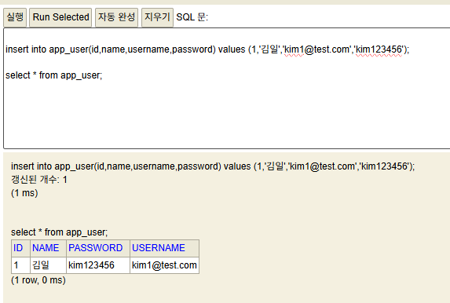

# 3월 2일 - 커리큘럼 50%
1. 2월 19일 : sql 시험
2. 2월 24일 : 스프링 부트 관련 두개 과목

dml은 row
dcl은 통제권환
- grant  : 부여
- revoke : 회수
# DDL - column을 만지작, 테이블 자체를 만지니 row와도 연관
```sql
-- 1. CREATE : 테이블 생성
CREATE TABLE students(
	student_id INT AUTO_INCREMENT PRIMARY KEY,
	full_name VARCHAR(50) NOT NULL,
	email VARCHAR(100) UNIQUE,
	birth_date DATE,
	created_at TIMESTAMP DEFAULT CURRENT_TIMESTAMP  
); 
```

## ALTER : 테이블 수정
- 이미 만들어진 테이블에 새로운 컬럼을 추가하거나 타입을 변경할 때 사용

```sql
-- 컬럼 추가할때
ALTER TABLE students ADD phone VARCHAR(20); 

-- 컬럼 데이터 타입 수정
ALTER TABLE students MODIFY COLUMN full_name VARCHAR(100);
```

## DROP : 테이블 삭제
테이블 자체를 완전히 삭제(복구가 어려움)

```sql
-- 테이블 삭제
DROP TABLE students;
```

# DML(Data Manipulation Language)
데이터를 직접 조작하는 create(INSERT), read(SELECT) , update(UPDATE), delete(DELETE)<br>
즉, row와 관련됨

## INSERT : 데이터 추가
데이터를 삽입할때는 컬럼 순서와 데이터 타입을 일치시켜야함

```sql
-- row 하나만 삽입
INSERT INTO students (full_name, email, birth_date)VALUES('김일','kim1@test.com','2026-02-12');

INSERT INTO students (full_name, email)
	VALUES('김이','kim2@test.com'),
			('김삼','kim3@test.com');

```

## UPDATE : 데이터 수정
* 참조 사항 : `where`절 생략시 테이블이 모든 행이 수정

```sql
-- update
UPDATE students SET birth_date = '1990-01-01'
WHERE student_id = 6;

UPDATE students SET phone = '010-2019-0952'
WHERE student_id = 7;

```

## DELETE : 데이터 삭제
* 참조 사항 : 마찬가지로 `where`을 이용해 특정 row만 삭제한다.
고유값(pk)의 의미가 중요한 이유

```sql
DELETE 
FROM students 
WHERE student_id = 8;
```

# 통합 과제
1. 이하의 테이블들을 생성하시오.
    - courses
        - course_id : 자동증가 적용 / pk 적용 / int
        - course_name : 문자열 not null 적용
        - professor : 문자열(50)
        - credits : int default 3
    
    - enrollments
        - enrollments_id : 자동증가 / pk / int
        - student_id : int / fk
        - course_id : int / fk
        - enroll_date : DATE

2. 더미 데이터 삽입
    - courses 테이블에 
        - 데이터베이스 기초 / 강교수 / 3
        - 자바프로그래밍 / 이교수 / 4
        - 웹디자인 / 박교수 / 2
    - enrollments의 student_id / course_id / enroll_date에
    - 1,1 '2026-02-01'
    - 1,2 '2026-02-01'
    - 2,1 '2026-02-02'

```sql
SELECT * FROM courses ;
SELECT * FROM enrollments ;
SELECT * FROM students;

/*
CREATE TABLE courses(
	course_id INT AUTO_INCREMENT PRIMARY KEY,
	course_name VARCHAR(50) NOT NULL,
	professor VARCHAR(50) ,
	credits INT DEFAULT 3 
);
*/
/*
CREATE TABLE enrollments(
	enrollments_id INT AUTO_INCREMENT PRIMARY KEY,
	student_id INT ,
	course_id INT ,
	enroll_date DATE,
	CONSTRAINT fk_student
        FOREIGN KEY (student_id) REFERENCES students(student_id),
   CONSTRAINT fk_course
        FOREIGN KEY (course_id) REFERENCES courses(course_id)
);
*/
/*
INSERT into courses (course_name, professor,credits) 
	VALUES ('데이터베이스 기초' , '강교수' , 3),
			('자바프로그래밍' , '이교수' , 4),
			('웹디자인' , '박교수' ,2);
*/
/*
INSERT into enrollments (student_id ,course_id, enroll_date) 
	VALUES (1,1, '2026-02-01'),
			 (1,2, '2026-02-01'),
			 (2,1, '2026-02-02');
*/

--
-- SELECT s.full_name,c.course_name AS 과목,e.enroll_date AS 등록날짜 ,c.professor AS 교수이름
-- FROM students s , courses c , enrollments e  
-- WHERE s.student_id = e.student_id AND c.course_id = e.course_id AND  s.student_id = 1

```

# 통합과제 2
create<br>
문제 1.1: 새로운 학생 '박지민'(park@test.com, 1995-05-05, 010-5555-6666)을 students 테이블에 추가하세요.

문제 1.2: 새로운 과목 '파이썬 프로그래밍'(최교수, 3학점)을 courses 테이블에 추가하세요.

문제 1.3: 방금 추가한 '박지민' 학생이 '파이썬 프로그래밍'과 '데이터베이스기초' 과목을 오늘 날짜로 수강 신청하게 하세요.

주의: SELECT 문으로 먼저 학생과 과목의 ID 번호를 확인한 뒤 INSERT 하세요.

Read (데이터 조회)<br>
 문제 2.1: '이교수'가 담당하는 모든 과목의 이름을 출력하세요.
문제 2.2: 이메일 주소에 'test.com'이 포함된 학생들의 이름과 전화번호를 조회하세요.

문제 2.3 [JOIN]: 현재 '데이터베이스기초' 과목을 듣고 있는 학생들의 이름과 그들의 수강 신청 날짜를 출력하세요.

Update (데이터 수정)<br>
문제 3.1: kim2 학생의 전화번호가 010-1597-7533으로 변경되었습니다. 정보를 수정하세요.

문제 3.2: '웹디자인' 과목의 담당 교수가 '박교수'에서 '김교수'로 변경되었습니다. 과목 정보를 업데이트하세요.

문제 3.3: 모든 과목의 학점(credits)을 1학점씩 상향 조정하세요.

Delete (데이터 삭제)<br>
문제 4.1: kim2 학생이 자퇴를 결정했습니다. students 테이블에서 해당 학생을 삭제하세요.

돌발 상황: 만약 삭제 시 외래키 에러가 발생한다면, 왜 발생하는지 설명하고 enrollments 테이블의 데이터를 먼저 삭제한 뒤 다시 시도해 보세요.

문제 4.2: 수강 인원이 0명인 과목을 찾아 courses 테이블에서 삭제하세요.


```sql
-- 1.1
-- INSERT INTO students (full_name, email, birth_date,phone)
-- VALUES ('박지민','park@test.com', '1995-05-05', '010-5555-6666');
-- 1.2
-- INSERT INTO courses (course_name, professor, credits)
-- VALUES ('파이썬 프로그래밍','최교수', 3);

-- 1.3
/*
INSERT INTO enrollments (student_id,course_id,enroll_date) 
VALUES
(3,1,'2026-02-12'),
(3,4,'2026-02-12');
*/

SELECT * FROM enrollments ;
SELECT * FROM students;

-- 2.1
SELECT course_name
FROM courses
WHERE professor = '이교수';

-- 2.2
SELECT full_name , phone
FROM students
WHERE email LIKE '%test%';

-- 2.3
SELECT s.full_name , e.enroll_date
FROM students s, enrollments e, courses c
WHERE s.student_id = e.student_id AND c.course_id = e.course_id AND c.course_name = '데이터베이스 기초'

-- 3.1
-- UPDATE students SET phone = '010-1597-7533' WHERE full_name = '이이';

-- 3.2
-- UPDATE courses SET professor = '김교수' WHERE professor = '박교수';

-- 3.3
-- UPDATE courses SET credits = credits+1;

-- 4.1
DELETE 
FROM enrollments
WHERE student_id = (
	SELECT student_id
	from students 
	WHERE full_name = '이이'
	);

DELETE 
from students 
WHERE full_name = '이이';

-- 4.2
DELETE 
FROM courses
WHERE course_id NOT IN (
	SELECT course_id
	from enrollments 
	);

```

- 이상의 경우 sql문만 봤을때 오류가 발생하는지 확신할 수 없다.

- 이는 GUI 형태로 FK제약 조건을 설정했을 때, update / delete 시에 'restrict'로 설정했기 때문에 실패하고 나왔다.

- 그래서 'cascade'로 설정을 바꾸자 `DELETE FROM students WHERE student_id = 3;`가 아무 문제 없이 돌아가는 것을 볼 수 있다.

- FK 제약조건이 달려있는 테이블을 sql로 설정하기

```sql


```

# korit_12_springboot

# 통합 과제 # 3
- AppUser 클래스를 정의하시오.
 1. field 목록
    - id(pk/자동증가/Long)
    - name(String)
    - username(String)
    - password(String)
 2. 생성자를 만드시오(JPA에서는 NoArgsConstructor가 필수다.)
 3. SpringBoot 프로젝트를 실행시키고
    - id, name, username, password 순으로 1, 김일, kim1@test.com, kim123456으로 row
    - select * from App_user;를 통해 row 확인
    - 캡처해서 md파일에 옮겨놓고 자습

